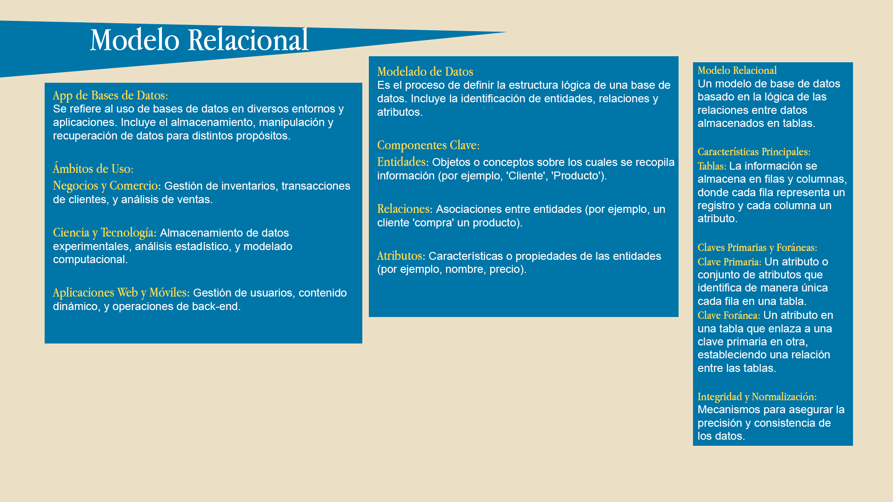
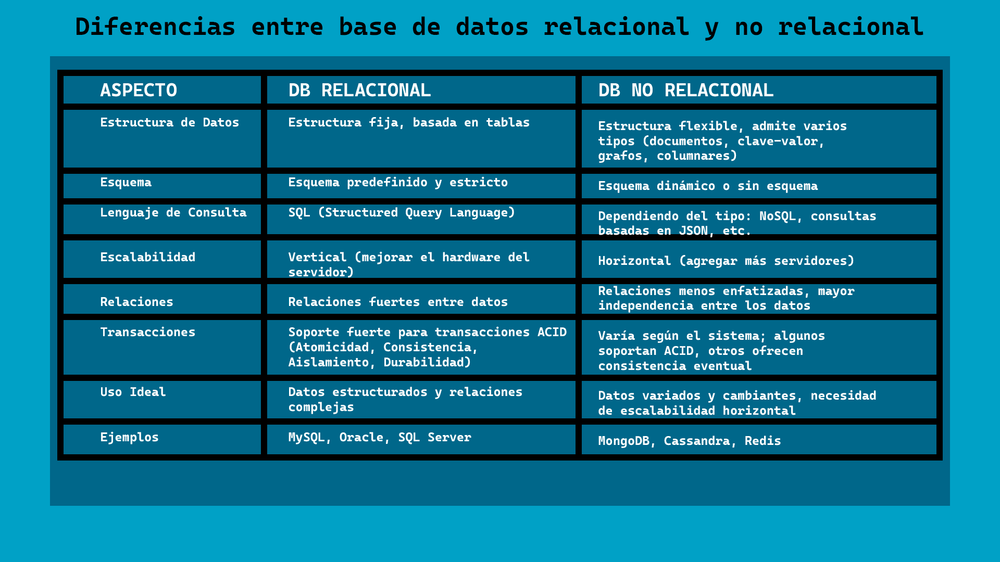
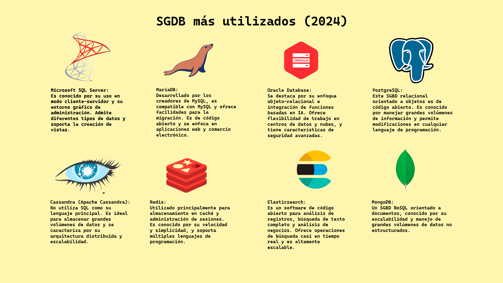
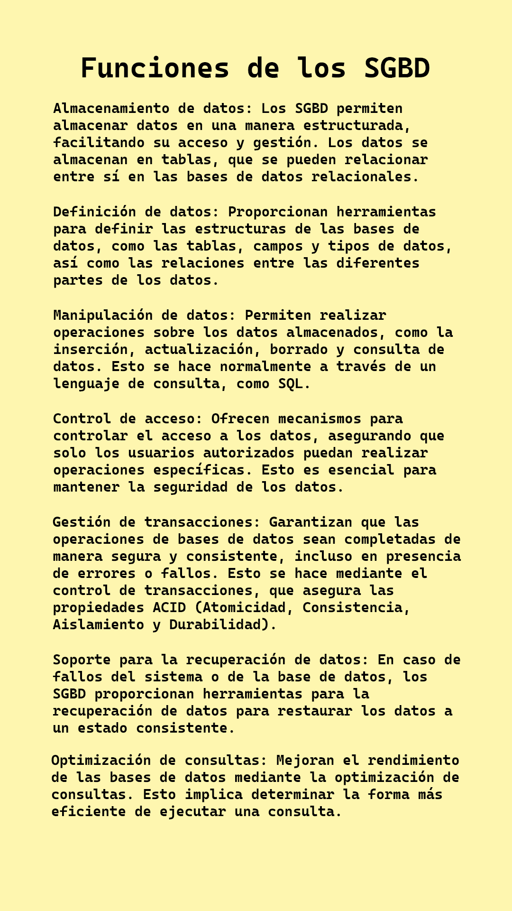
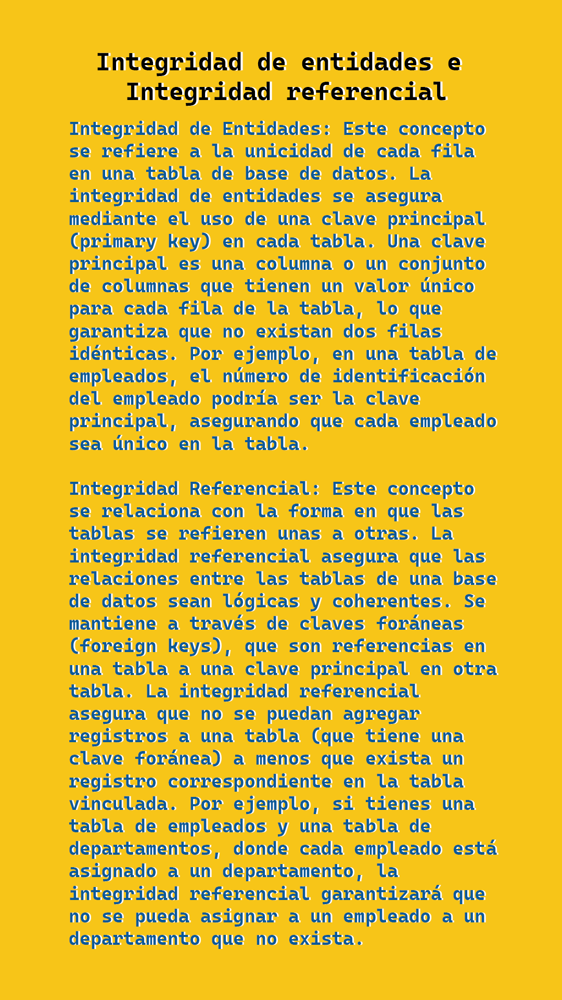
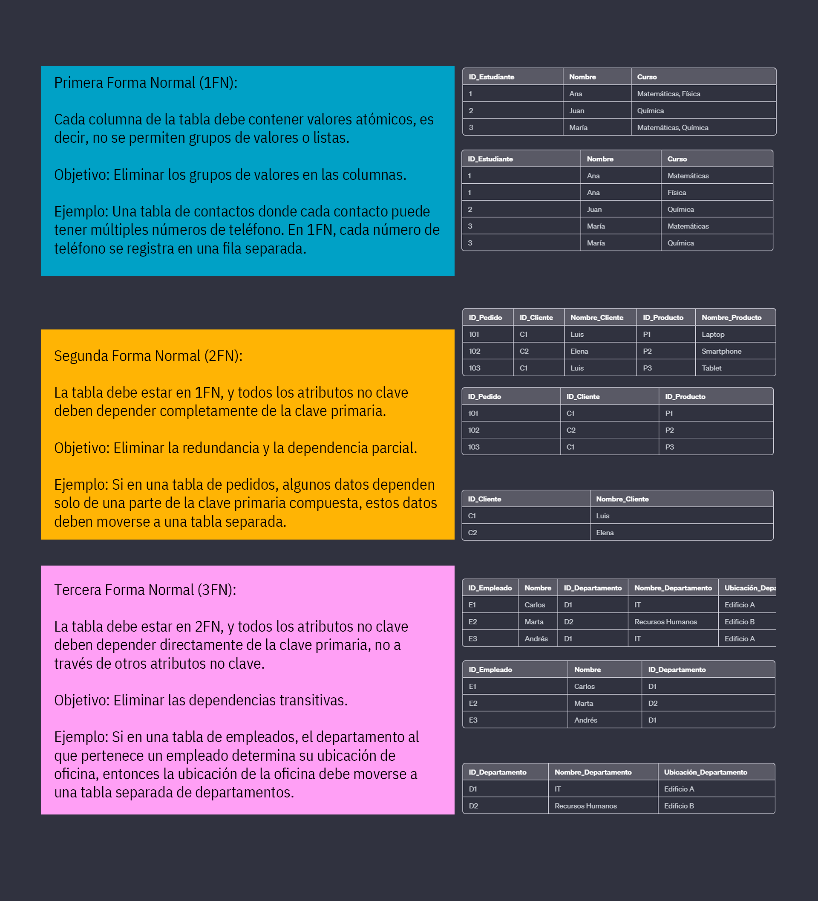
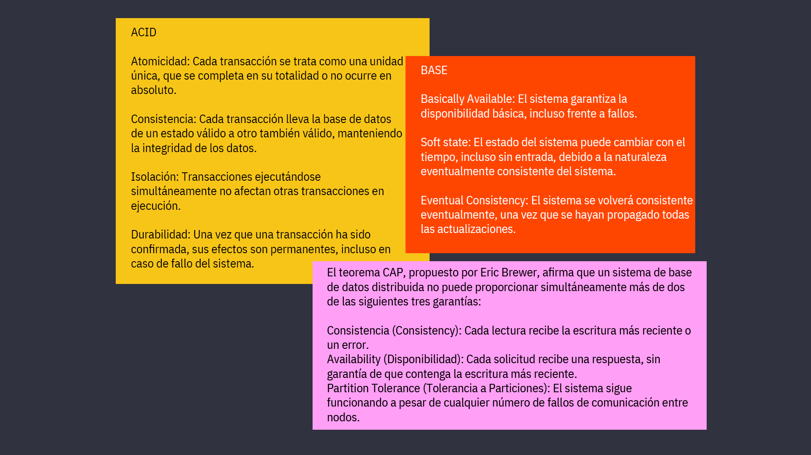
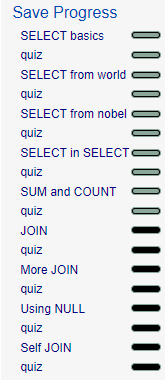
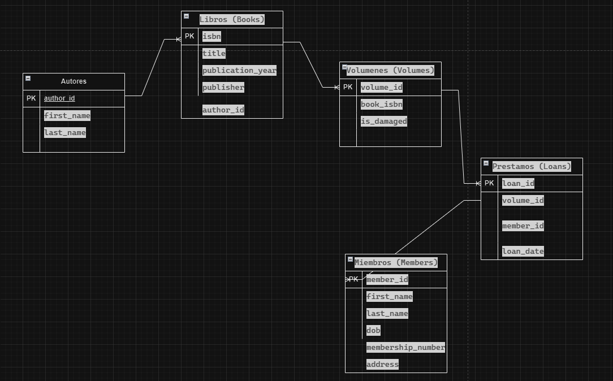

# Alumno: RUBEN BERNARDO RUIZ VEGA - CLOUD DATABASES

## Portada
Bases de Datos para Cloud Apps
Nombre del Alumno: Rubén Bernardo Ruíz Vega
28 de enero de 2024

## Introducción
Esta primera tarea es para explicar la importancia de los conceptos básicos de Bases de Datos y específicamente en la Nube. En clase se explicaron demás temas relacionados que funcionan como parte integral del plan de estudios y los conocimientos esperados al finalizar esta unidad. 

## Mapas Conceptuales por Cada Fuente Sugerida

---

---

---

---

---

---

---
## Quizes de SQL

---

## Tablas del ejercicio de la biblioteca

---

## Bibliografía
1. "Data Modeling - What is Data Modeling?" - AWS. Disponible en: [https://aws.amazon.com/es/what-is/data-modeling/](https://aws.amazon.com/es/what-is/data-modeling/)
2. "NoSQL - Introducción a las bases de datos no estructuradas" - SlideShare. Disponible en: [https://es.slideshare.net/dipina/nosql-introduccin-a-las-bases-de-datos-no-estructuradas](https://es.slideshare.net/dipina/nosql-introduccin-a-las-bases-de-datos-no-estructuradas)
3. "The Difference Between ACID and BASE Database" - AWS. Disponible en: [https://aws.amazon.com/compare/the-difference-between-acid-and-base-database/](https://aws.amazon.com/compare/the-difference-between-acid-and-base-database/)